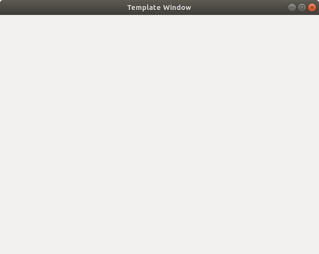

## Template for GTK+3 application with Glade GUI.



Clone this repo and you are ready to deal with GTK development.

VS Code supported. Use `Ctrl + Shift + B` to build app.

### Instalation

```
$ git clone https://github.com/mhcrnl/gtk_template.git
$ make
$ ./template_app

```